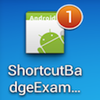
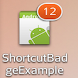
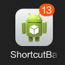
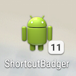
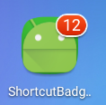
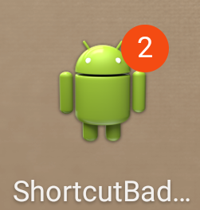
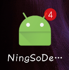
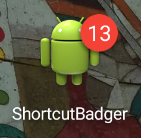
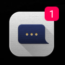
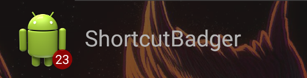

# PH.Leolin.ShortcutBadger

[](https://www.nuget.org/packages/PH.Leolin.ShortcutBadger/)

A Xamarin Android binding for [Leo Lin, ShortcutBadger](https://github.com/leolin310148/ShortcutBadger). 

## Nuget Package

The latest stable binding package can be found on [Nuget](https://www.nuget.org/packages/PH.Leolin.ShortcutBadger/), based on version `1.1.18`.

```text
Install-Package PH.Leolin.ShortcutBadger
```

## Usage

-  For Xamarin implementation see the [sample project](/src/SampleApp) in this repo.
-  For original Android project see the [sample](https://github.com/leolin310148/ShortcutBadger/tree/master/SampleApp) and [documentation](https://github.com/leolin310148/ShortcutBadger#isbadgeworking).

<br/>
<hr />
<br/>

## ShortcutBadger Readme details:

<table>
    <tr>
        <td width="130">
            <h3>Sony</h3>
            <br>
            
        </td>
        <td width="130">
            <h3>Samsung</h3>
            <br>
            
        </td>
        <td width="130">
            <h3>LG</h3>
            <br>
            
        </td>
        <td width="130">
            <h3>HTC</h3>
            <br>
            
        </td>
    </tr>
    <tr>
        <td width="130">
            <h3>Xiaomi</h3>
            <br>
            
            <br>
        </td>
        <td width="130">
            <h3>ASUS</h3>
            <br>
            
        </td>
        <td width="130">
            <h3>ADW</h3>
            <br>
            
        </td>
        <td width="130">
            <h3>APEX</h3>
            <br>
            
        </td>
    <tr>
        <td width="130">
            <h3>NOVA</h3>
            <br>
            
        </td>
        <td width="130">
            <h3>Huawei</h3>
            <br>
            (Not Fully Support)
            <br>
            
            <br>
            (1.1.7+)
        </td>
        <td width="130">
            <h3>ZUK</h3>
            <br>
            
            <br>
            (1.1.10+)
        </td>
        <td width="130">
            <h3>OPPO</h3>
            <br>
            (Not Fully Support)
            <br>
            
            <br>
            (1.1.10+)
        </td>
    </tr>
    <tr>
        <td width="130">
            <h3>EverythingMe</h3>
            <br>
            
        </td>
        <td width="130">
            <h3>ZTE</h3>
            <br>
            
            <br>
            (1.1.17+)
        </td>
        <td width="260" colspan="2">
            <h3>KISS</h3>
            <br>
            
            <br>
            (1.1.18+)
        </td>
    </tr>
</table>

* Nova launcher with TeslaUnread, Apex launcher, ADW Launcher provided by [notz](https://github.com/notz)
* Solid launcher provided by [MajeurAndroid](https://github.com/MajeurAndroid)
* KISS Launcher provided by [alexander255](https://github.com/alexander255)

## About Xiaomi devices
Xiaomi devices require extra setup with notifications, please read [wiki](https://github.com/leolin310148/ShortcutBadger/wiki/Xiaomi-Device-Support).

## IsBadgeWorking? 

A tool for displaying your device, launcher & android version and testing whether ShortcutBadger
works or not may be downloaded from

* Google Play [https://play.google.com/store/apps/details?id=me.leolin.isbadgeworking](https://play.google.com/store/apps/details?id=me.leolin.isbadgeworking)
* The GitHub repository [https://github.com/leolin310148/IsBadgeWorking.Android/releases](https://github.com/leolin310148/IsBadgeWorking.Android/releases)


